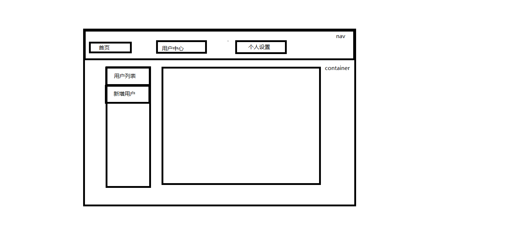

## react-router 4

### 创建react项目,并安装react-router-dom

	npm install create-react-app -g
	
	create-react-app my-app

	cd my-app
	
	npm install react-router-dom -S 

### 创建最简单的路由，在地址栏中分别输入/home,/about,/profile来验证

创建src/index.js

	import React from 'react'
	import ReactDOM from 'react-dom'
	import {
	    BrowserRouter as Router,// 容器
	    Route, // 一条路由
	} from 'react-router-dom'
	
	function MyRouter() {
	    return <h1>myRouter</h1>
	}
	function Home() {
	    return <h1>home</h1>
	}
	function About() {
	    return <h1>about</h1>
	}
	function Profile() {
	    return <h1>profile</h1>
	}
	
	ReactDOM.render(
	    <Router>
	        

	            <Route path="/" component={MyRouter}/>
	            <Route path="/home" component={Home}/>
	            <Route path="/about" component={About}/>
	            <Route path="/profile" component={Profile}/>
	        

	    </Router>, document.getElementById('root')
	)

### 组件分离，引入bootstrap

src/index.js
	
	import React from 'react'
	import ReactDOM from 'react-dom'
	import App from './components/App'
	
	ReactDOM.render(
	    <App/>, document.getElementById('root')
	)

src/components/App.js

	import React from 'react'
	import {
	    BrowserRouter as Router,// 容器,HashRouter多次点击会报错
	    Route, // 一条路由
	    Link
	} from 'react-router-dom'
	
	import Home from './Home'
	import User from './User'
	import Profile from './Profile'
	import 'bootstrap/dist/css/bootstrap.css'
	
	class App extends React.Component{
	    render(){
	        return(
	            <Router>
	                

	                    <nav className="navbar navbar-inverse">
	                        

	                            

	                                
系统管理

	                            

	                        

	                        <ul className="nav navbar-nav">
	                            <li>
	                                <Link to="/home">首页</Link>
	                            </li>
	                            <li>
	                                <Link to="/user">用户</Link>
	                            </li>
	                            <li>
	                                <Link to="/profile">个人中心</Link>
	                            </li>
	                        </ul>
	                    </nav>
	
	                    

	                        

	                            

	                                <Route path="/home" component={Home}/>
	                                <Route path="/user" component={User}/>
	                                <Route path="/profile" component={Profile}/>
	                            

	                        

	                    

	                

	            </Router>
	        )
	    }
	}
	
	export default App;
	
	/*
	
	export default (
	    <Router>
	        

	            <Route path="/home" component={Home}/>
	            <Route path="/user" component={User}/>
	            <Route path="/profile" component={Profile}/>
	        

	    </Router>
	)
	
	说明：
	（1）使用这种写法时，在index.js中引入该文件的时候，
	
	    import App from './components/App'
	
	     ReactDOM.render(
	        App, document.getElementById('root')
	     )
	
	（2）如果是使用class App extends React.Component{}这种写法
	
	     import App from './components/App'
	
	     ReactDOM.render(
	     <App/>, document.getElementById('root')
	     )
	
	*/

src/components/User.js

	import React,{Component} from 'react'
	class User extends Component{
	    render(){
	        return(
	            
user

	        )
	    }
	}
	export default User;

src/components/Profile.js

	import React,{Component} from 'react'
	class Profile extends Component{
	    render(){
	        return(
	            
profile

	        )
	    }
	}
	export default Profile;

src/components/Home.js
	
	import React,{Component} from 'react'
	class Home extends Component{
	    render(){
	        return(
	            
home

	        )
	    }
	}
	export default Home;

说明：

使用HashRouter时，多次点击同一个路由时，会报一个警告：

	Warning: Hash history cannot PUSH the same path; a new entry will not be added to the history stack

解决：使用BrowerRouter 替换

### 嵌套路由

在User组件中实现嵌套路由

src/components/User.js
	
	import React,{Component} from 'react'
	import {Link,Route} from 'react-router-dom'
	
	import UserList from './UserList'
	import UserAdd from './UserAdd'
	
	class User extends Component{
	    render(){
	        return(
	            

	                

	                    

	                        <ul className="nav nav-stacked">
	                            <li>
	                                <Link to="/user/list">用户列表</Link>
	                            </li>
	                            <li>
	                                <Link to="/user/add">新增用户</Link>
	                            </li>
	                        </ul>
	                    

	                    

	                        <Route path="/user/list" component={UserList}></Route>
	                        <Route path="/user/add" component={UserAdd}></Route>
	                    

	                

	            

	        )
	    }
	}
	export default User;

src/components/UserList.js

	import React,{Component} from 'react'
	class UserList extends Component{
	    render(){
	        return(
	            

	                用户列表
	            

	        )
	    }
	}
	export default UserList;

src/components/UserAdd.js
	
	import React,{Component} from 'react'
	class UserAdd extends Component{
	    render(){
	        return(
	            

	                新增用户
	            

	        )
	    }
	}
	export default UserAdd;

### 实现用户管理功能，列表+详情页+userAdd

src/components/User.js

	import React,{Component} from 'react'
	import {Link,Route} from 'react-router-dom'
	
	import UserList from './UserList'
	import UserAdd from './UserAdd'
	import UserDetail from './UserDetail'
	
	class User extends Component{
	    render(){
	        return(
	            

	                

	                    

	                        <ul className="nav nav-stacked">
	                            <li>
	                                <Link to="/user/list">用户列表</Link>
	                            </li>
	                            <li>
	                                <Link to="/user/add">新增用户</Link>
	                            </li>
	                        </ul>
	                    

	                    

	                        <Route path="/user/list" component={UserList} />
	                        <Route path="/user/add" component={UserAdd} />
	                        <Route path="/user/detail/:id" component={UserDetail} />
	                    

	                

	            

	        )
	    }
	}
	export default User;

src/components/UserDetail.js

	import React,{Component} from 'react'
	class UserDetail extends Component{
	    render(){
	        // this.props三个属性
	        // history : 路由跳转，包含location
	        // match : 匹配结果
	        // location：pathname当前路径
	
	        let id = this.props.match.params.id;
	
	        // 从缓存中读取字用户列表符串 null或者是字符串
	        let userStr = localStorage.getItem("users");
	
	        // 转化成对象数组
	        let users = userStr ? JSON.parse(userStr) : [];
	
	        let user = users.find(user=>user.id == id);
	
	        return(
	
	            

	                {/*{this.props.match.params.id}*/}
	
	                <table className="table">
	                    <thead>
	                        <tr>
	                            <th>ID</th>
	                            <th>姓名</th>
	                        </tr>
	                    </thead>
	                    <tbody>
	                    <tr>
	                        <td>{user.id}</td>
	                        <td>{user.name}</td>
	                    </tr>
	                    </tbody>
	                </table>
	            

	        )
	    }
	}
	export default UserDetail;

src/components/UserList.js

	import React,{Component} from 'react'
	import {Link} from 'react-router-dom'
	class UserList extends Component{
	
	    constructor(props){
	        super(props);
	        this.state = {users:[]};
	    }
	
	    componentWillMount(){
	        // 从缓存中读取字用户列表符串 null或者是字符串
	        let userStr = localStorage.getItem("users");
	
	        // 转化成对象数组
	        let users = userStr ? JSON.parse(userStr) : [];
	
	        this.setState({users});
	    }
	
	    render(){
	        return(
	            

	                <ul className="list-group">
	                    {/*<li className="list-group-item">*/}
	                        {/*<Link to="/user/detail/1">张三</Link>*/}
	                    {/*</li>*/}
	                    {/*<li className="list-group-item">*/}
	                        {/*<Link to="/user/detail/2">李四</Link>*/}
	                    {/*</li>*/}
	                    {
	                        this.state.users.map(function (user) {
	                            return (
	                                <li className="list-group-item" key={user.id}>
	                                    <Link to={"/user/detail/"+user.id}>{user.name}</Link>
	                                </li>
	                            )
	                        })
	                    }
	                </ul>
	            

	        )
	    }
	}
	export default UserList;

src/components/UserAdd.js

	import React,{Component} from 'react'
	class UserAdd extends Component{
	    constructor(props){
	        super(props);
	    }
	    handleSubmit=()=>{
	        // ref属性可以操作真实的DOM元素，获取到input的value
	        let name = this.name.value;
	
	        // 从缓存中读取字用户列表符串 null或者是字符串
	        let userStr = localStorage.getItem("users");
	
	        // 转化成对象数组
	        let users = userStr ? JSON.parse(userStr) : [];
	
	        // 向此数组中加入新的对象
	        users.push({id:Date.now(),name});
	
	        // 再把新数组重新缓存
	        localStorage.setItem("users",JSON.stringify(users));
	
	        // 通过history的push方法，跳转路由到list列表页面
	        this.props.history.push('/user/list');
	    }
	    render(){
	        return(
	            

	                <form onSubmit={this.handleSubmit.bind(this)}>
	                    

	                        <label htmlFor="name">姓名</label>
	                        <input type="text" id="name" className="form-control" ref={ref=>this.name=ref}/>
	                    

	                    

	                        <input type="submit" className="btn bg-primary" value="添加"/>
	                    

	                </form>
	            

	        )
	    }
	}
	export default UserAdd;

### Switch组件，选择匹配，顺序匹配，匹配成功一个之后，后面就不能再匹配了

src/components/App.js

	import React from 'react'
	import {
	    BrowserRouter as Router,// 容器
	    Route, // 一条路由
	    Link,
	    Switch
	} from 'react-router-dom'
	
	import Home from './Home'
	import User from './User'
	import Profile from './Profile'
	import 'bootstrap/dist/css/bootstrap.css'
	
	class App extends React.Component{
	    render(){
	        return(
	            <Router>
	                

	                    <nav className="navbar navbar-inverse">
	                        

	                            

	                                
系统管理

	                            

	                        

	                        <ul className="nav navbar-nav">
	                            <li>
	                                <Link to="/home">首页</Link>
	                            </li>
	                            <li>
	                                <Link to="/user">用户</Link>
	                            </li>
	                            <li>
	                                <Link to="/profile">个人中心</Link>
	                            </li>
	                        </ul>
	                    </nav>
	
	                    

	                        

	                            

	                                {/*以下两种写法一样：*/}
	                                {/*<Route path="/" render={props=>
首页
} />*/}
	                                {/*<Route path="/" component={Home} />*/}
	                                {/*<Route path="/:name" render={props=>
name:{props.match.params.name}
}></Route>*/}
	                                <Switch>
	                                    <Route exact path="/" component={Home} />{/*exact：精确匹配，*/}
	                                    {/*<Route path="/:name" render={props=>
name:{props.match.params.name}
}></Route>*/}
	                                    <Route path="/home" component={Home}/>
	                                    <Route path="/user" component={User}/>
	                                    <Route path="/profile" component={Profile}/>
	                                </Switch>
	                            

	                        

	                    

	                

	            </Router>
	        )
	    }
	}
	
	export default App;

### exact属性路由精确匹配，否则的话，只要有/的路由，都会显示这个component

	<Route exact path="/" component={Home} />{/*exact：精确匹配，*/}

### 实现登录和退出的功能

redirect：重定向到另一个路由

withRouter:使用此方法来插入react-router路由参数

首先自定义一个路由组件ProtectedRoute，给两个属性path，component,用来取代原来的路由组件

src/components/App.js

	import React from 'react'
	import {
	    BrowserRouter as Router,// 容器
	    Route, // 一条路由
	    Link,
	    Switch
	} from 'react-router-dom'
	
	import Home from './Home'               // 首页
	import User from './User'               // 用户
	import Profile from './Profile'         // 个人中心
	import 'bootstrap/dist/css/bootstrap.css'
	
	/*当访问个人设置的时候，需要先判断用户是否登录，如果已登录则允许进入，否则的话则不允许进入*/
	import Login from './Login'              // 登录
	import ProtectedRoute from './ProtectedRoute'
	
	class App extends React.Component{
	    render(){
	        return(
	            <Router>
	                

	                    <nav className="navbar navbar-inverse">
	                        

	                            

	                                
系统管理

	                            

	                        

	                        <ul className="nav navbar-nav">
	                            <li>
	                                <Link to="/home">首页</Link>
	                            </li>
	                            <li>
	                                <Link to="/user">用户</Link>
	                            </li>
	                            <li>
	                                <Link to="/profile">个人中心</Link>
	                            </li>
	                        </ul>
	                    </nav>
	
	                    

	                        

	                            

	                                <Switch>
	                                    <Route exact path="/" component={Home} />{/*exact：精确匹配，*/}
	                                    <Route path="/home" component={Home}/>
	                                    <Route path="/user" component={User}/>
	                                    <Route path="/login" component={Login}/>
	                                    <ProtectedRoute path="/profile" component={Profile}/>
	                                </Switch>
	                            

	                        

	                    

	                

	            </Router>
	        )
	    }
	}
	
	export default App;

src/components/ProtectedRoute.js

	import React,{Component} from 'react'
	import {Redirect,Route} from 'react-router-dom'
	// 当通过函数来定义组件的时候，参数是属性对象
	// 当一个组件不需要状态的时候用函数组建，当一个组件必须用状态的时候用类来声明
	// props两个属性：props={path="/profile"  component=Profile}
	// rest = {path="/profile"}
	// <Route {...rest}/> == <Route path="/profile"/>
	export default function ({component:Component,...rest}) {
	    // 参数结构赋值，属性名component，当前变量Component
	    // ...rest,其他运算符，其余参数
	    return <Route {...rest} render={
	        (props)=>
	            localStorage.getItem("login")
	                ? <Component/>
	                : <Redirect to={
	                    {
	                        pathname:"/login",
	                        state:{from:props.location.pathname}
	                    }
	                }/>
	    }/>
	    
}

src/components/Login.js

	import React from 'react'
	export default function (props) {
	    return <button className="btn btn-primary"
	                   onClick={()=>{
	
	                       localStorage.setItem("login",'true');
	
	                       // 跳转
	                       props.history.push(props.location.state.from)
	
	                   }}>登录</button>
	}

### 自定义菜单

webstrom注释快捷键，在函数上面输入 /**+回车

src/components/App.js

	import React from 'react'
	import {
	    BrowserRouter as Router,// 容器
	    Route, // 一条路由
	    Link,
	    Switch
	} from 'react-router-dom'
	
	import Home from './Home'               // 首页
	import User from './User'               // 用户
	import Profile from './Profile'         // 个人中心
	import 'bootstrap/dist/css/bootstrap.css'
	
	/*当访问个人设置的时候，需要先判断用户是否登录，如果已登录则允许进入，否则的话则不允许进入*/
	import Login from './Login'              // 登录
	import ProtectedRoute from './ProtectedRoute'
	
	// 自定义菜单
	
	import MenuLink from './MenuLink'
	
	class App extends React.Component{
	    render(){
	        return(
	            <Router>
	                

	                    <nav className="navbar navbar-inverse">
	                        

	                            

	                                
系统管理

	                            

	                        

	                        <ul className="nav navbar-nav">
	                            {/*<li>*/}
	                                {/*<Link to="/home">首页</Link>*/}
	                            {/*</li>*/}
	                            {/*<li>*/}
	                                {/*<Link to="/user">用户</Link>*/}
	                            {/*</li>*/}
	                            {/*<li>*/}
	                                {/*<Link to="/profile">个人中心</Link>*/}
	                            {/*</li>*/}
	                            <MenuLink label="首页" to="/home"/>
	                            <MenuLink label="用户中心" to="/user"/>
	                            <MenuLink label="个人设置" to="/profile"/>
	                        </ul>
	                    </nav>
	
	                    

	                        

	                            

	                                {/*以下两种写法一样：*/}
	                                {/*<Route path="/" render={props=>
首页
} />*/}
	                                {/*<Route path="/" component={Home} />*/}
	                                {/*<Route path="/:name" render={props=>
name:{props.match.params.name}
}></Route>*/}
	                                <Switch>
	                                    <Route exact path="/" component={Home} />{/*exact：精确匹配，*/}
	                                    {/*<Route path="/:name" render={props=>
name:{props.match.params.name}
}></Route>*/}
	                                    <Route path="/home" component={Home}/>
	                                    <Route path="/user" component={User}/>
	                                    <Route path="/login" component={Login}/>
	
	                                    <ProtectedRoute path="/profile" component={Profile}/>
	                                    {/*<Route path="/profile" component={Profile}/>*/}
	                                </Switch>
	                            

	                        

	                    

	                

	            </Router>
	        )
	    }
	}
	
	export default App;

src/components/MenuLink.js

	import React from 'react'
	import {Route,Link} from 'react-router-dom'
	
	/**
	 * 有的组件，不管当前路径是否匹配，都显示内容，使用children
	 */
	
	export default function ({to,label}) {// 参数解构，两个属性to,label
	    return (
	        <Route path={to} children={({match})=>{// 三个props:match,history,location,解构出来{match}
	            console.log(match)
	            return <li className={ match ? 'active' : '' }><Link to={to}>{label}</Link></li>
	        }} />
	    )
	}
	
	/*
	*
	* Route
	* 属性path=""，component=""
	*
	* 方法：render={()=>{}} children={()=>{}}
	*
	* */

### 在跳转的时候进行一个提示

src/components/UserAdd.js

	import React,{Component} from 'react'
	import {Prompt} from 'react-router-dom' // 引入路由的弹出框
	class UserAdd extends Component{
	    constructor(props){
	        super(props);
	
	        // 默认不阻止跳转
	        this.state={
	            blocking:false
	        }
	
	    }
	    handleSubmit=()=>{
	        // ref属性可以操作真实的DOM元素，获取到input的value
	        let name = this.name.value;
	
	        // 从缓存中读取字用户列表符串 null或者是字符串
	        let userStr = localStorage.getItem("users");
	
	        // 转化成对象数组
	        let users = userStr ? JSON.parse(userStr) : [];
	
	        // 向此数组中加入新的对象
	        users.push({id:Date.now(),name});
	
	        // 再把新数组重新缓存
	        localStorage.setItem("users",JSON.stringify(users));
	
	        // 先设置状态在跳转
	        this.setState({
	            blocking:false
	        },()=>{
	            // 通过history的push方法，跳转路由到list列表页面
	            this.props.history.push('/user/list');
	        })
	
	    }
	    // 当input有内容的时候
	    handleChange = (event)=>{
	        this.setState({
	            blocking:event.target.value && event.target.value.length>0
	        })
	        console.log(this.state.blocking)
	    }
	
	    render(){
	        return(
	            

	                {/*提示框 Prompt*/}
	                <Prompt
	                    when={this.state.blocking}
	                    message={(location)=>`确定要跳转到${location.pathname}吗？`}
	                />
	
	                <form onSubmit={this.handleSubmit.bind(this)}>
	                    

	                        <label htmlFor="name">姓名</label>
	                        <input type="text" id="name" className="form-control" ref={ref=>this.name=ref} onChange={this.handleChange}/>
	                    

	                    

	                        <input type="submit" className="btn bg-primary" value="添加"/>
	                    

	                </form>
	            

	
	        )
	    }
	}
	export default UserAdd;

